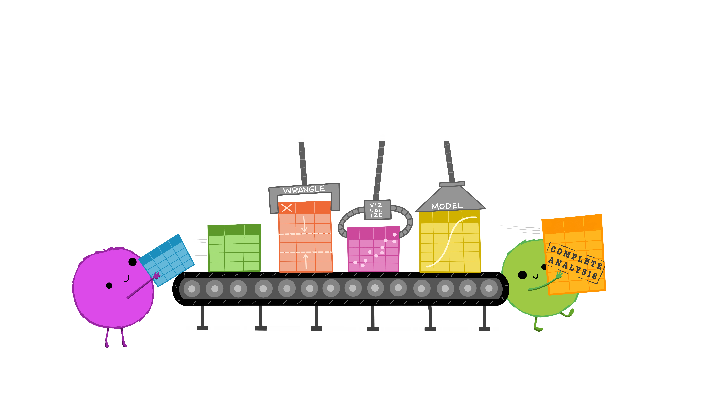

```{css, echo = FALSE}
.remark-slide-content {
  font-size: 28px;
  padding: 20px 80px 20px 80px;
}
.remark-code, .remark-inline-code {
  background: #f0f0f0;
}
.remark-code {
  font-size: 24px;
}
.huge .remark-code { /*Change made here*/
  font-size: 200% !important;
}
.tiny .remark-code { /*Change made here*/
  font-size: 50% !important;
}
.small .remark-code {
   font-size: 75% !important;
}
.remark-slide-content {
    font-size: 25px;
    padding: 1em 4em 1em 4em;
}
table { display: inline-block; }
th, td {
   padding: 5px;
}
small-slide {
   font-size: 70% !important;
}
```

```{r setup, include=FALSE}
options(htmltools.dir.version = FALSE, fig.width = 3, fig.height = 3)
knitr::opts_chunk$set(fig.dim=c(3, 3), fig.align = "center")
library(tidyverse)
```


# Who am I?

   * Adi Sarid
   
   * Professional: Market Research, Data Scientist, Operations Research, R Educator
   
   * Academia: PhD in operations research from TAU, the industrial engineering department
   
   * Teaching the introduction to statistics and R course ("Data Analysis" 0560.1823) in the digital sciences for hi-tech program in TAU
   
   * Software: R, Python
   
   * Personal: lives in Netanya, father of three

---

# Who is this workshop for?

   * Since this workshop is given online, anyone is welcome, but specifically:
   
   * This workshop is for students in the digital science for hi-tech program in TAU
   
   * No prior knowledge in `R` programming language
   
   * Studying introduction to statistics in the management school (can't attend the built-in intro statistics course of the digital sciences program)

---

# Workshop Goals

   * Students will acquire `R` skills
   
   * Learn how `R` can be used for preparing data, visualizing data, and modeling data
   
   * We will assume that you already know the theory behind statistics, and focus on practical (and fun!) stuff

   * **By the end of the workshop students will be able to take a data set and analyze it in meaningful ways, drawing conclusions, and presenting the results.**

---

# What to expect today?

   * Today you will build your first plot in `R`!
   
   * You will visualize google mobility trends in Israel, and discuss how they were affected by Covid-19
   
   * You will see how data is structured (and discuss tidy data)
   
   * You will discuss the data origin and see problems with it
   
   * We will see the RStudio IDE and demonstrate base-R syntax

---

# Technical details

Our workshop is going to be comprised of:
   
   * Lectures: background and explanations
   
   * Demonstrations: live coding and analysis of data sets
      
   * Labs: these are either tutorials as we will do today, or coding in your computer in R
   
   * Optional home assignments: tasks I will give each week (which I will solve in the following session)

---

# Tech stack / sources

   * All the code and materials are available on github: [https://bit.ly/tau-r-workshop](https://bit.ly/tau-r-workshop)
   
   * You will need [R](https://www.r-project.org/) and [RStudio Desktop](https://rstudio.com/products/rstudio/download/) which are both open source and free to download and use
   
   * The `tidyverse` package (`install.packages("tidyverse")`)
   
   * Syllabus, books, youtube channels, and other sources: see github repo README.md under reading materials.


---

# Covid19 mobility trends

   * For this lab we're going to split to breakout rooms
   
   * Each group will solve the exercise here: [sarid.shinyapps.io/covid19_mobility](sarid.shinyapps.io/covid19_mobility)
   
   * We will give 20 minutes for this exercise, but I will circulate among the rooms and see if you need more/less time
   
   * Upon completion, we will solve the exercise together
   
---

# Some context: the data science workflow


Source: Illustrations by [Allison Horst](https://github.com/allisonhorst/stats-illustrations)

---

# Back to the basics

Switching to some live coding session:

   * We will demonstrate base R syntax
   
   * We will familiarize ourselves with the RStudio IDE

---

# Tidy data: a friendly definition


Illustrations from the Openscapes blog Tidy Data for reproducibility, efficiency, and collaboration by Julia Lowndes and Allison Horst.

---

# Tidy data: tidy versus untidy


**Excel users have a tendency to get data to be untidy:** merged cells, colored cells, aggregated cells, skipping rows, hidden columns, formulas, pivot tables, etc...

---

# Tidy data: a consistent set of tools


---

# Tidy data: we all speak the same language


---

# Tidy data: and can automate many tasks



---

# Tidy data: tidy is good


---

# Tidy data


---

# Optional homework

Read about tidytuesday [here](https://github.com/rfordatascience/tidytuesday).

Watch a tidytuesday video [here](https://www.youtube.com/user/safe4democracy/videos).