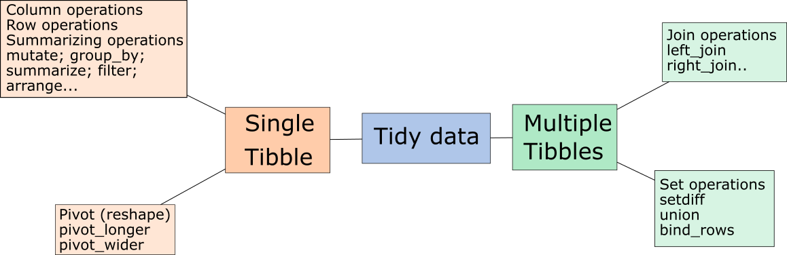

```{css, echo = FALSE}
.remark-slide-content {
  font-size: 28px;
  padding: 20px 80px 20px 80px;
}
.remark-code, .remark-inline-code {
  background: #f0f0f0;
}
.remark-code {
  font-size: 24px;
}
.huge .remark-code { /*Change made here*/
  font-size: 200% !important;
}
.tiny .remark-code { /*Change made here*/
  font-size: 50% !important;
}
.small .remark-code {
   font-size: 75% !important;
}
.remark-slide-content {
    font-size: 25px;
    padding: 1em 4em 1em 4em;
}
table { display: inline-block; }
th, td {
   padding: 5px;
}
small-slide {
   font-size: 70% !important;
}
```

```{r setup, include=FALSE}
options(htmltools.dir.version = FALSE, fig.width = 3, fig.height = 3)
knitr::opts_chunk$set(fig.dim=c(3, 3), fig.align = "center")
library(tidyverse)
```


# Recap from last week 

In the previous session

   * We demonstrated data transformations, specifically we discussed
   
      * Operations that summarize data (e.g., compute mean, sd, percentiles)
   
   * We talked about visualizations
   
   * You learned the theory behind the "grammar of graphics"
   
   * You implemented the theory using the `ggplot2` package
   
The week before that we also discussed

   * Data wrangling, specifically
   
      * `mutate`, `count`, `select`, `filter`

---

# Today's focus: data transformations and wrangling (part 2)


Source: Illustrations by [Allison Horst](https://github.com/allisonhorst/stats-illustrations)


---

# What we will do today

   * Complete some missing pieces related to data transformations and wrangling
   
      * Changing the data representation (changing long to wide formats or vice verse)
      
      * Merging (joining) data sets
      

---

# Conceptual map of basic tidyverse operations



---

# Changing the data representation (long vs. wide)

Very often you will be required to change the data representation, from wide to long format (or vice verse).

   * This is called pivoting, and you can use `pivot_longer` or `pivot_wider`
   * Especially useful when plotting with `ggplot2`, which we will discuss next week


---

# Joining data sets (combine tables)

Sometimes we have multiple sources of data, and we need to join them, or add them to one another

   * Joining = Combining variables, adding new columns using shared key variables (`left_join`, `right_join`, `full_join`)
   * Binding = Combining cases, adding new rows from another source, which has the same variables (`bind_rows`)

---

# Summarising exercise

In this exercise you will explore (transform and wrangle) [Himalayan Climbing Expeditions](https://github.com/rfordatascience/tidytuesday/blob/master/data/2020/2020-09-22/readme.md).

   * Expeditions that climbed in the Nepal Himalaya
   
   * To complete this exercise you will need R, RStudio IDE. 
   
   * Download and follow the instructions [here](https://github.com/adisarid/intro_statistics_R_TAU_Workshop/blob/main/labs/Tidying%20Himalayan%20Climbing%20Expeditions/02-Data-Transformations-and-Wrangling-Himalayan-Exercise.R)
   
      * Start from exercise 4 in that file

---

# Wrap up

   * We have seen a lot of tidyverse basics for data transformations and wrangling
   
      * Focusing on summarizing functions, pivoting
   
   * You experienced the various functions using the Himalayan Climbing Expeditions data set from the tidytuesday repository
   
   * Next week we will discuss hypothesis testing and linear regression